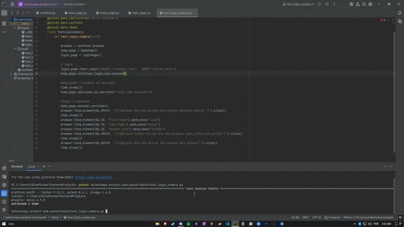

# pytest-selenium-checkout-pom
End-to-end test automation project built with Pytest and Selenium WebDriver. The framework follows the Page Object Model (POM) pattern, separating page logic into dedicated classes to improve code organization, readability, reusability, and maintainability.

## 🎬 Test Execution Demo

